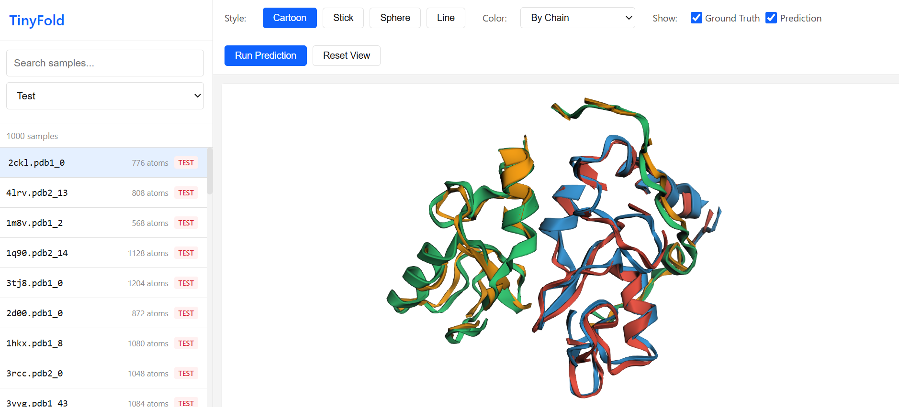

# TinyFold

A lightweight diffusion-based model for binary protein-protein interaction (PPI) structure prediction. Inspired by [AlphaFold3](https://www.nature.com/articles/s41586-024-07487-w) and [Boltz-2](https://github.com/jwohlwend/boltz), but designed to be small (<30M parameters) and trainable on a single consumer GPU. Includes a web frontend for interactive visualization.

<p align="center">
  
  <br>
  <em>Carefully curated held-out test set example of predicted vs ground truth complexes. Green-blue: ground truth. Red-yellow: predicted.</em>
</p>

## Overview

TinyFold predicts the 3D structure of two interacting protein chains using a **two-stage approach**:

1. **Stage 1 (Residue Diffusion)**: Predict residue centroid positions using a diffusion model operating on L tokens (one per residue) instead of 4L atoms.

2. **Stage 2 (Atom Refinement)**: Refine centroid predictions to full backbone atom coordinates (N, CA, C, O) using local attention.

This hierarchical design is motivated by the observation that **backbone topology is the hard problem**—local bond geometry is well-constrained by chemistry.

### Key Features

- **Compact**: ~28M parameters total (13.8M Stage 1 + 14.2M Stage 2)
- **Efficient**: First-stage decoder operates on residue-level tokens, not atoms (4x fewer tokens in the first stage)
- **Modular**: Train stages independently or end-to-end
- **Practical**: Single GPU training (RTX 4070 Ti, ~8 hours for Stage 1)

### Rationale

Complex folding couples global arrangement (chain–chain positioning) with local atomic detail (side-chain packing, interface chemistry). We decouple these by predicting structure at two resolutions:

1. **Residue-level diffusion (global scaffold)**: sample residue anchors for each chain to capture fold topology and relative orientation in the complex.

2. **All-atom refinement (local consistency)**: condition on the residue scaffold to generate full atomic coordinates, resolving side chains and interface packing.

Why this helps:

- **Efficiency / compactness**: modeling long-range geometry at residue resolution reduces sequence length and degrees of freedom seen by the attention decoder, enabling a smaller model without sacrificing the ability to represent inter-chain organization.

- **Interaction learning without explicit pair features**: rather than maintaining an explicit pairwise tensor (as in Pairformer-like designs), residue–residue dependencies are learned implicitly through attention over the coarse structural scaffold.

- **Stability and controllability**: the global scaffold constrains refinement, reducing search complexity for the all-atom stage and making it easier to incorporate constraints (fixed subunits, known domains, interface restraints).

### Practical benefits / deployment modes

- **Partial-known complexes**: if one partner is known, keep it fixed and diffuse only the unknown partner’s residue scaffold, then refine—turning full complex prediction into a cheaper conditional docking-style problem.

- **Pocket-conditioned ligand placement**: given a predefined binding pocket, first diffuse a coarse ligand representation/pose relative to pocket anchors, then refine to an all-atom, chemically valid pose.

## Architecture

### Stage 1: Residue Diffusion

The diffusion model predicts clean residue centroids from noisy inputs:

- **ResidueEncoder (Trunk)**: Processes sequence, chain IDs, and positions through a 9-layer Transformer. Runs once per sample to produce conditioning tokens.
- **DiffusionTransformer (Denoiser)**: Iteratively denoises centroid positions over T=50 steps using Adaptive LayerNorm conditioning.
- **Output**: Predicted centroid positions [L, 3]

### Stage 2: Atom Refinement

One-shot prediction of 4 backbone atoms per residue:

- **GlobalTransformer**: 6-layer Transformer captures inter-residue context
- **LocalAtomAttention**: Attention within each residue's 4 atoms predicts offsets from centroid
- **Output**: Backbone atom positions [L, 4, 3] (N, CA, C, O)

### Auxiliary Losses

Beyond the primary MSE loss on coordinates, we use geometry-based auxiliary losses to enforce chemically valid structures in the second phase of the prediction:

#### Bond Length Loss
Penalizes deviations from ideal backbone bond lengths:

$$\mathcal{L}_\text{bond} = \sum_{i} \left[ (d_\text{N-CA}^{(i)} - 1.458)^2 + (d_\text{CA-C}^{(i)} - 1.525)^2 + (d_\text{C-O}^{(i)} - 1.229)^2 \right] + \sum_{i} (d_\text{C-N}^{(i,i+1)} - 1.329)^2$$

where distances are in Ångströms.

#### Bond Angle Loss
Enforces tetrahedral geometry at Cα and planar geometry at the peptide bond:

$$\mathcal{L}_\text{angle} = \sum_{i} \left[ (\theta_\text{N-CA-C}^{(i)} - 111°)^2 + (\theta_\text{CA-C-O}^{(i)} - 121°)^2 + (\theta_\text{CA-C-N}^{(i,i+1)} - 117°)^2 + (\theta_\text{C-N-CA}^{(i,i+1)} - 121°)^2 \right]$$

#### Omega Dihedral Loss (Peptide Planarity)
The omega dihedral angle $\omega = \text{CA}_i\text{-C}_i\text{-N}_{i+1}\text{-CA}_{i+1}$ should be ~180° (trans) or ~0° (cis):

$$\mathcal{L}_\omega = \sum_{i} \min\left[ (|\omega_i| - \pi)^2, \omega_i^2 \right]$$

This allows both trans (~99.5% of peptide bonds) and cis configurations.

#### Chirality Losses
Proteins use L-amino acids exclusively, which constrains the stereochemistry:

**Carbonyl O Chirality**: The carbonyl oxygen must be on the correct side of the peptide plane (trans to the next Cα):

$$\mathcal{L}_\text{O-chiral} = \text{ReLU}\left( \text{sign}(\vec{n} \cdot \vec{v}_\text{O}) \cdot \text{sign}(\vec{n} \cdot \vec{v}_\text{CA-next}) \right)$$

where $\vec{n} = (\text{C}-\text{CA}) \times (\text{N}_\text{next}-\text{C})$ is the peptide plane normal.

**Virtual Cβ Chirality** (optional): Even without side chains, we can enforce L-amino acid handedness by computing a virtual Cβ position and checking its improper dihedral:

$$\chi_\text{improper} = \text{dihedral}(\text{N}, \text{CA}, \text{C}, \text{CB}_\text{virtual}) \approx -34°$$

#### Distance Consistency Loss
Preserves pairwise Cα distances between the prediction and ground truth for contact residues (within 10Å):

$$\mathcal{L}_\text{dist} = \frac{1}{|C|} \sum_{(i,j) \in C} \left( d_{ij}^\text{pred} - d_{ij}^\text{GT} \right)^2$$

where $C$ is the set of contact pairs. Inter-chain contacts are weighted 2× higher.

### Comparison

| Aspect | TinyFold | AlphaFold3 | Boltz-2 |
|--------|----------|------------|---------|
| Diffusion target | L residue centroids | All atoms | All atoms |
| Pair features | Implicit in attention | Explicit Pairformer | Explicit Pairformer |
| Per-step alignment | No | No | Kabsch |
| Model size | 28M params | 600M+ params | 700M+ params |
| Training hardware | Single GPU | TPU pod | Multi-GPU cluster |


### Requirements

- Python 3.10+
- PyTorch 2.0+
- CUDA-capable GPU (12GB+ VRAM)


### Training

```bash
# Stage 1: Residue diffusion
python scripts/train_resfold.py \
    --mode stage1_only \
    --n_train 20000 \
    --n_steps 50000 \
    --output_dir outputs/stage1

# Stage 2: Atom refinement (using Stage 1 predictions)
python scripts/train_resfold.py \
    --mode stage2_only \
    --stage1_dir outputs/stage1 \
    --n_steps 20000 \
    --output_dir outputs/stage2
```

### Inference

```bash
python scripts/predict.py \
    --checkpoint outputs/stage1/best_model.pt \
    --pdb1 chain_a.pdb \
    --pdb2 chain_b.pdb \
    --output prediction.pdb
```

### Web Frontend

Launch the interactive visualization frontend:

```bash
cd web
../.venv/Scripts/python.exe server.py
# Open http://127.0.0.1:5001
```

See [doc/frontend.md](doc/frontend.md) for detailed documentation including:
- Generating cached predictions
- Light mode for embedding
- JavaScript API for integration

## Dataset

I currently only use the **DIPS-Plus** dataset:
- 28,352 binary protein complexes
- Backbone atoms only (N, CA, C, O)

Download and preprocess:
```bash
python scripts/prepare_data.py --output-dir data/processed
```

## In the works

- [ ] Boltz-2 style per-step Kabsch alignment
- [ ] Energy-based auxiliary losses
- [ ] Proper benchmarking (DockQ, lDDT)
- [ ] Extension to small molecules/DNA/other macromolecules
- [ ] Web frontend for visualization

