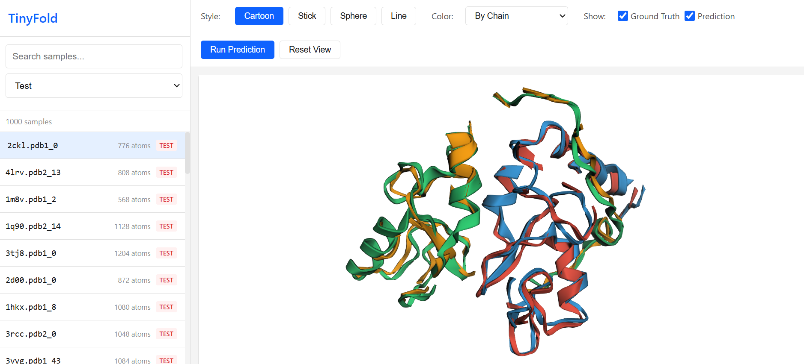

# TinyFold

A lightweight diffusion-based model for binary protein-protein interaction (PPI) structure prediction. Inspired by [AlphaFold3](https://www.nature.com/articles/s41586-024-07487-w) and [Boltz-2](https://github.com/jwohlwend/boltz), but designed to be small (<30M parameters) and trainable on a single consumer GPU. Includes a web frontend for interactive visualization.

<p align="center">
  
  <br>
  <em>Carefully curated held-out test set example of predicted vs ground truth complexes. Green-blue: ground truth. Red-yellow: predicted.</em>
</p>

## Overview

TinyFold predicts the 3D structure of two interacting protein chains using a **two-stage approach**:

1. **Stage 1 (Residue Diffusion)**: Predict residue centroid positions using a diffusion model operating on L tokens (one per residue) instead of 4L atoms.

2. **Stage 2 (Atom Refinement)**: Refine centroid predictions to full backbone atom coordinates (N, CA, C, O) using local attention.

This hierarchical design is motivated by the observation that **backbone topology is the hard problem**—local bond geometry is well-constrained by chemistry.

### Key Features

- **Tiny**: the headline model (`onestep`) is **11.8M parameters** — ~50× smaller than the smallest open AF3-class models.
- **Single consumer GPU, from scratch**: the headline run trains in **~80 minutes on one RTX 4070 Ti SUPER (16 GB)** — no MSAs (frozen ESM-2-35M embeddings), no cluster.
- **AF3-shaped**: continuous-σ (EDM) diffusion, ESM conditioning, multi-sample inference with a confidence ranker, few-step ODE sampling.
- **Efficient core**: the diffusion target is residue centroids (L tokens), not 4L atoms; a parallel atom head emits backbone (N, CA, C, O).

> Two model families live in this repo: the original **two-stage** `ResFoldPipeline` (~28M) and the **single-network** `ResFoldOneStep` (11.8M) used for the headline result below. New work should use `onestep`.

### Rationale

Complex folding couples global arrangement (chain–chain positioning) with local atomic detail (side-chain packing, interface chemistry). We decouple these by predicting structure at two resolutions:

1. **Residue-level diffusion (global scaffold)**: sample residue anchors for each chain to capture fold topology and relative orientation in the complex.

2. **All-atom refinement (local consistency)**: condition on the residue scaffold to generate full atomic coordinates, resolving side chains and interface packing.

Why this helps:

- **Efficiency / compactness**: modeling long-range geometry at residue resolution reduces sequence length and degrees of freedom seen by the attention decoder, enabling a smaller model without sacrificing the ability to represent inter-chain organization.

- **Interaction learning without explicit pair features**: rather than maintaining an explicit pairwise tensor (as in Pairformer-like designs), residue–residue dependencies are learned implicitly through attention over the coarse structural scaffold.

- **Stability and controllability**: the global scaffold constrains refinement, reducing search complexity for the all-atom stage and making it easier to incorporate constraints (fixed subunits, known domains, interface restraints).

### Practical benefits / deployment modes

- **Partial-known complexes**: if one partner is known, keep it fixed and diffuse only the unknown partner’s residue scaffold, then refine—turning full complex prediction into a cheaper conditional docking-style problem.

- **Pocket-conditioned ligand placement**: given a predefined binding pocket, first diffuse a coarse ligand representation/pose relative to pocket anchors, then refine to an all-atom, chemically valid pose.

## Results — what works, and what doesn't

The honest headline: **the pipeline genuinely works on *small* complexes and breaks
down on large ones.** This was established by the Small-Specialist Confirmation
(SSC) experiment — an `onestep` model trained *only* on small complexes
(≤200 total residues), evaluated on a held-out test set, then run out-of-distribution
on larger complexes with the *same* weights.

**In-distribution (small ≤200 res, n=200 held-out test, K=5 + confidence rank):**

| metric | value |
|---|---|
| mean DockQ | **0.258** |
| success (DockQ ≥ 0.23, CAPRI acceptable) | **43.5%** |
| CAPRI bands (incorrect / acceptable / **medium** / high) | 113 / 34 / **53** / 0 |
| centroid RMSE · C-RMSD · oracle@5 | 6.30 Å · 10.28 Å · 5.80 Å |

**53 / 200 predictions are CAPRI medium-quality** (DockQ ≥ 0.49 — topologically
correct interfaces) on complexes the model never saw. It generalizes rather than
memorizes: test DockQ rose monotonically through training (0.139 → 0.258) with a
moderate train/test gap (train 0.357 / 66%). The best held-out predictions reach
DockQ ~0.73 at ~1 Å C-RMSD (see the showcase).

**Out-of-distribution (same checkpoint, larger complexes):**

| bin (total residues) | 200–400 | 400–600 | 600–1000 | ≥1000 |
|---|---|---|---|---|
| mean DockQ | 0.018 | 0.013 | 0.012 | 0.007 |
| success | 0% | 0% | 0% | 0% |

A clean, monotone collapse — the wall is input **size**, not training-set breadth
(same weights, only the inputs grew). This is a small model's honest operating
envelope, not a bug.

See [`scripts/eval_dockq_histogram.py`](scripts/eval_dockq_histogram.py) for the
per-complex CAPRI breakdown and [the reproduce section](#reproduce-the-headline-experiment).

## Architecture

### Stage 1: Residue Diffusion

The diffusion model predicts clean residue centroids from noisy inputs:

- **ResidueEncoder (Trunk)**: Processes sequence, chain IDs, and positions through a 9-layer Transformer. Runs once per sample to produce conditioning tokens.
- **DiffusionTransformer (Denoiser)**: Iteratively denoises centroid positions over T=50 steps using Adaptive LayerNorm conditioning.
- **Output**: Predicted centroid positions [L, 3]

### Stage 2: Atom Refinement

One-shot prediction of 4 backbone atoms per residue:

- **GlobalTransformer**: 6-layer Transformer captures inter-residue context
- **LocalAtomAttention**: Attention within each residue's 4 atoms predicts offsets from centroid
- **Output**: Backbone atom positions [L, 4, 3] (N, CA, C, O)

### Auxiliary Losses (Stage 2)

Beyond the primary MSE loss on coordinates, Stage 2 (atom refinement) uses geometry-based auxiliary losses to enforce chemically valid backbone structures. These losses operate on the predicted [L, 4, 3] atom coordinates and are not applied during Stage 1 (residue diffusion), which uses only MSE + distance consistency.

#### Bond Length Loss
Penalizes deviations from ideal backbone bond lengths:

$$\mathcal{L}_\text{bond} = \sum_{i} \left[ (d_\text{N-CA}^{(i)} - 1.458)^2 + (d_\text{CA-C}^{(i)} - 1.525)^2 + (d_\text{C-O}^{(i)} - 1.229)^2 \right] + \sum_{i} (d_\text{C-N}^{(i,i+1)} - 1.329)^2$$

where distances are in Ångströms.

#### Bond Angle Loss
Enforces tetrahedral geometry at Cα and planar geometry at the peptide bond:

$$\mathcal{L}_\text{angle} = \sum_{i} \left[ (\theta_\text{N-CA-C}^{(i)} - 111°)^2 + (\theta_\text{CA-C-O}^{(i)} - 121°)^2 + (\theta_\text{CA-C-N}^{(i,i+1)} - 117°)^2 + (\theta_\text{C-N-CA}^{(i,i+1)} - 121°)^2 \right]$$

#### Omega Dihedral Loss (Peptide Planarity)
The omega dihedral angle $\omega = \text{CA}_i\text{-C}_i\text{-N}_{i+1}\text{-CA}_{i+1}$ should be ~180° (trans) or ~0° (cis):

$$\mathcal{L}_\omega = \sum_{i} \min\left[ (|\omega_i| - \pi)^2, \omega_i^2 \right]$$

This allows both trans (~99.5% of peptide bonds) and cis configurations.

#### Chirality Losses
Proteins use L-amino acids exclusively, which constrains the stereochemistry:

**Carbonyl O Chirality**: The carbonyl oxygen must be on the correct side of the peptide plane (trans to the next Cα):

$$\mathcal{L}_\text{O-chiral} = \text{ReLU}\left( \text{sign}(\vec{n} \cdot \vec{v}_\text{O}) \cdot \text{sign}(\vec{n} \cdot \vec{v}_\text{CA-next}) \right)$$

where $\vec{n} = (\text{C}-\text{CA}) \times (\text{N}_\text{next}-\text{C})$ is the peptide plane normal.

**Virtual Cβ Chirality** (experimental, currently disabled): Even without side chains, L-amino acid handedness can be enforced by computing a virtual Cβ position and checking its improper dihedral:

$$\chi_\text{improper} = \text{dihedral}(\text{N}, \text{CA}, \text{C}, \text{CB}_\text{virtual}) \approx -34°$$

This loss is implemented but has not been enabled in any training run (weight=0.0).

#### Distance Consistency Loss (Both Stages)
Preserves pairwise Cα distances between the prediction and ground truth for contact residues (within 10Å):

$$\mathcal{L}_\text{dist} = \frac{1}{|C|} \sum_{(i,j) \in C} \left( d_{ij}^\text{pred} - d_{ij}^\text{GT} \right)^2$$

where $C$ is the set of contact pairs. Inter-chain contacts are weighted 2× higher.

### Comparison

| Aspect | TinyFold (onestep) | AlphaFold3 | Boltz-1 | Protenix-Mini |
|--------|----------|------------|---------|---------------|
| Diffusion target | L residue centroids | All atoms | All atoms | All atoms |
| Pair features | Implicit in attention | Explicit Pairformer | Explicit Pairformer | Pairformer (pruned 48→16) |
| Sequence conditioning | Frozen ESM-2-35M | MSA | MSA | MSA or ESM |
| Sampling | Few-step ODE / 1-shot | Multi-step | Multi-step | 2-step ODE |
| Model size | **11.8M params** | hundreds of M | hundreds of M | compact, derived from cluster-trained base |
| Training hardware | **1 consumer GPU, from scratch** | TPU pod | GPU cluster | GPU cluster (pruned/distilled) |
| Scope | Backbone PPI, small complexes | All biomolecules | All biomolecules | All biomolecules |

TinyFold is **not** AF3-accurate or general — it is the same *shape* of pipeline shrunk
~50× to fit one consumer GPU, as a testbed for "how far can a tiny model get."


### Requirements

- Python 3.10+
- PyTorch 2.0+
- CUDA-capable GPU (12GB+ VRAM)


### Reproduce the headline experiment

The Small-Specialist Confirmation (SSC) run is one config plus two eval scripts.
All commands run from the repo root; substitute your venv's Python for
`.venv/Scripts/python.exe`.

```bash
# 0. One-time: prepare data + cache ESM-2-35M embeddings
python scripts/data/prepare_data.py --output-dir data/processed
python scripts/prepare_esm2_embeddings.py            # writes data/processed/esm2_35M/

# 1. Train the small-specialist (~80 min on one RTX 4070 Ti SUPER)
python scripts/train_resfold.py --config configs/train/resfold/small_specialist_le200.yaml
#    -> outputs/resfold/small_specialist_le200/<run>/best_model.pt + split.json

# 2. Per-complex DockQ + CAPRI histogram (small test set + OOD large bins)
python scripts/eval_dockq_histogram.py \
    --checkpoint outputs/resfold/small_specialist_le200/<run>/best_model.pt \
    --small_split outputs/resfold/small_specialist_le200/<run>/split.json

# 3. (optional) Regenerate the web-light showcase from the trained checkpoint
python scripts/web/build_showcase.py \
    --checkpoint outputs/resfold/small_specialist_le200/<run>/best_model.pt \
    --split      outputs/resfold/small_specialist_le200/<run>/split.json --top 6
```

The config trains an `onestep` model on complexes ≤200 total residues (pool 3,352;
3,000 train / 200 held-out test) and reports both train and test DockQ each eval
(`--eval_train_dockq`, the overfit control). The run's metrics are recorded in
`experiments/REGISTRY.md`.

### Inference

Predict + export a single complex from a **dataset sample**:

```bash
python scripts/predict.py \
    --checkpoint outputs/resfold/small_specialist_le200/<run>/best_model.pt \
    --sample_id 3lz0.pdb1_5 --out pred.pdb --write_gt
```

This composes the inference primitives in `tinyfold.inference` (architecture read
from the run's `config.json`, K-sample confidence-ranked one-shot sampling) and
writes the predicted complex (and optionally ground truth) to PDB, reporting DockQ.
Batch scoring/export go through `scripts/eval_dockq_histogram.py` and
`scripts/web/build_showcase.py`. Prediction from a **raw FASTA/PDB pair** (no
dataset row) additionally needs live ESM-2 inference + a de-novo coordinate-scale
convention — see the Roadmap.

### Web Frontend

**Zero-friction showcase (`web-light/`)** — a static, dependency-free viewer of the
best held-out predictions. Runs right after clone (Python stdlib only, no GPU, no
model load); ships with pre-generated data in `assets/showcase_samples.json`:

```bash
python web-light/server.py --port 5002
# Open http://127.0.0.1:5002
```

It overlays ground truth (blue/green) vs prediction (red/orange) in 3Dmol.js and
shows DockQ + CAPRI band per complex. Regenerate from a checkpoint with
`scripts/web/build_showcase.py` (see the reproduce section).

## Dataset

I currently only use the **DIPS-Plus** dataset:
- 41,883 binary protein complexes (80–3,106 total residues; median 455)
- Backbone atoms only (N, CA, C, O)
- The headline "small-specialist" trains on the 3,352 complexes ≤200 residues

Download and preprocess:
```bash
python scripts/data/prepare_data.py --output-dir data/processed
```

## Roadmap

- [x] Boltz-2 style per-step Kabsch alignment (available in all samplers)
- [x] Proper benchmarking (DockQ, lDDT, interface metrics)
- [x] Web frontend for visualization (static `web-light/` viewer)
- [x] Confirm the pipeline generalizes on small complexes (SSC experiment)
- [ ] Move the size cliff: interface cropping + relpos at scale, or the pair track (Phase H)
- [x] Single-sample predict/export CLI (`scripts/predict.py`, dataset samples)
- [ ] Raw FASTA/PDB-pair inference (live ESM-2 + de-novo coordinate scale)
- [ ] Energy-based auxiliary losses (Lennard-Jones, electrostatics)
- [ ] Extension to small molecules / DNA / other macromolecules
